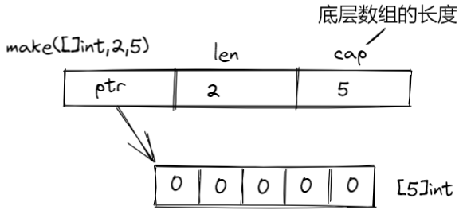
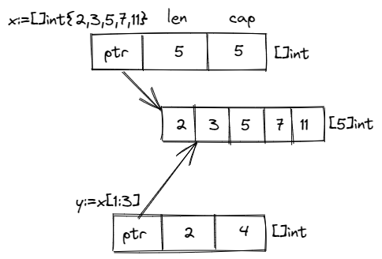
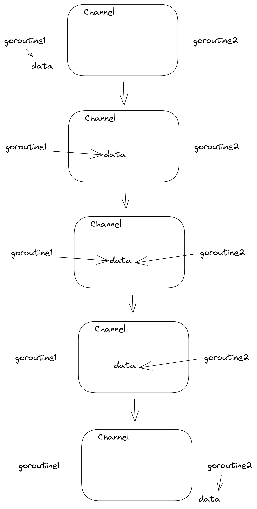

## 1. Go基础
### 1.1 Go主要特征
1. 自动立即回收
2. 丰富的内置类型
3. 函数多返回值
4. 错误处理
5. 匿名函数和闭包
6. 类型和接口
7. 并发编程
8. 反射
9. 语言交互性
### 1.2 Go命令
go command arguments
- `build`: compile packages and dependencies
- `clean`: remove object files
- `doc`: show documentation for package or symbol
- `env`: print Go environment information
- `bug`: start a bug report
- `fix`: run go tool fix on packages
- `fmt`: run gofmt on package source
- `generate`: generate Go files by processing source
- `get`: download and install packages and dependencies
- `install`: compile and install packages and dependencies
- `list`: list packages
- `run`: compile and run Go program
- `test`: test packages
- `tool`: run specified go tool
- `version`: print Go version
- `vet`: run go tool vet on packages
### 1.3 下划线_
#### 1.3.1 import _ package-name
仅仅执行init()函数,不把整个包导入进来
#### 1.3.2 在代码中
忽略变量（占位符）,如果不需要知道错误的返回值：  
`f,err := os.Open(filePath) => f,_ := os.Open(filePath)`
### 1.4 变量
####1.4.1 变量的声明
Go的变量必须声明后才能使用，且同一作用域内不支持重复声明
```go
var variable_name variable_type
//eg:
var name string
var age int
var ok bool
```
批量声明
```go
var (
	a string
	b int
	c bool
	d float32
)
```
#### 1.4.2 变量的初始化
```go
var variable_name variable_type = expressions/value
//eg:
var name string = "jack peter"
var set int = 799
var name,sex = "jack peter",1
```
#### 1.4.3 类型推导
省略变量类型，编译器会自动根据等号右边的值来推到变量的类型并完成初始化
```go
var name = "jack peter"
var sex = 799
```
#### 1.4.4 短变量声明
在函数内部，可以使用短变量声明并初始化变量  
**注意，不可用于函数外部**
```go
func main(){
	a:=10
	b:=12
	fmt.Println(m,n)
}
```
#### 1.4.5 匿名变量
在使用多重赋值时，如果想要忽略某个值，可以使用匿名变量（_）  
匿名变量不占用命名空间，不会分配内容，所以不存在重复声明
```go
func foo() (int,string){
	return 10 , "Q1mi"
}
func main() {
    x,_:=foo();
	_,y:=foo();
}
```
### 1.5 常量
#### 1.5.1 const
使用const定义一个常量，常量定义时必须赋值  
如果同时声明多个常量时，**如果省略了值则表示和上面一行的值相同**
```go
const pi=3.14

const (
	pi=3.14
	e=2.7182
)
//n1,n2,n3的值都是100
const (
	n1=100
	n2
	n3
)
```
#### 1.5.2 iota常量计数器
iota只能在常量的表达式中使用  
在const关键字出现时将被重置为0  
const中每新增一行常量声明将使iota计数一次（可以理解为行索引）
使用iota可以简化定义，在定义枚举时很有用
```go
const (
	n1=iota //0
	n2      //1
	n3      //2
	n4      //3
)

//跳过某些值
const (
	n1=iota  //1
	n2       //2
	_
	n4       //4
)

//声明中间插队
const (
	n1=iota  //0
	n2=100   //100
	n3=iota  //2
    n4       //3
)
const n5 = iota //0

//定义数量级
const (
	_ =iota
    KB = 1<<(10*iota)
    MB = 1<<(10*iota)
    GB = 1<<(10*iota)
    TB = 1<<(10*iota)
    PB = 1<<(10*iota)
)

//多个iota定义在一行
const (
	a,b=iota+1,iota+2  //iota=0  1,2
	c,d                //iota=1  2,3
	e,f                //iota=2  3,4
)
```
### 1.6基本数据类型
|类型|长度（字节）|默认值|说明|
|---|----------|-----|---|
|bool|1|false||
|byte|1|0|uint8|
|rune|4|0|Unicode Code Point,int32|
|int,uint|4或者8|0|32位或者64位|
|int8,uint8|1|0|-128~127,0~255,byte时uint的别名|
|int16,uint16|2|0|-32768~32767,0~65535|
|int32,uint32|4|0|-21亿~21亿,0~42亿,rune是int32的别名|
|int64,uint64|8|0|
|float32|4|0.0|
|float64|8|0.0|
|complex64|8|
|complex128|16|
|uintptr|4或者8| |存储指针的uint32或uint64整输|
|array| | |值类型|
|struct| | |值类型|
|string| |""|utf-8字符串|
|slice| |nil|引用类型|
|map| |nil|引用类型|
|channel| |nil|引用类型|
|interface| |nil|接口|
|function| |nil|函数|
支持八进制、十六进制，以及科学计数法,个数字类型的取值范围
```go
a,b,c,d:=071,0x1F,1e9,math.MinInt16
```
空指针为nil，而非null
#### 1.6.1 整型
`int8`,`int16`,`int32`,`int64`
对应的无符号整型`uint8`,`uint16`,`uint32`,`uint64`
`uint8`是我们熟知的`byte`型
`int16`对应C中的`short`
`int64`对应C中的`long`
#### 1.6.2 浮点型
`float32`和`float64`
#### 1.6.3 复数
`complex64`和`complex128`
复数都有实部和虚部，`complex64`实部和虚部都为32位，`complex128`实部和虚部都为64位
#### 1.6.4 布尔值
整型不允许强制转换为布尔型
#### 1.6.5 字符串
使用utf-8实现，可以在源码中直接使用非ASCII码字符
#### 1.6.6 字符串转义符
`\r` 回车符（返回行首）  
`\n` 换行符（直接跳到下一行的同列位置）  
`\t` 制表符  
`\'` 单引号  
`\"` 双引号  
`\\` 反斜杠  
#### 1.6.7 多行字符串
反引号中的换行将作为字符串中的换行，但是所有转义字符均无效
```go
s1:=`第一行
        第二行
        第三行
        `       
```
#### 1.6.8 字符串的常用草所
|方法|描述|
|---|---|
|`len(str)`|求长度|
|`+或者fmt.Sprintf`|拼接字符串|
|`strings.Split`|分割|
|`strings.Contains`|判断是否包含|
|`strings.HasPrefix,strings.HasSuffix`|前缀后缀的判断|
|`strings.Index,strings.LastIndex`|子串出现的位置|
|`string.Join(ar [] string,sep string)`|join操作|
#### 1.6.9 byte和rune类型
使用byte来处理默认的字符  
使用rune来处理Unicode字符（中文，日文和其他符合字符）  
**字符串是不能修改的**
#### 1.6.10 修改字符串
```go
func changeStr(){
	s1:="hello"
	byteS1:=[]byte(s1)
	byteS1[0]='H'
	fmt.println(string(byteS1))
}
```
#### 1.6.11 类型转换
Go中只有强制类型转换，没有隐式类型转换。  
只有在两个类型之间相互支持转换时才可以使用
```go
T(expressions)
```
```go
func sqrtDemo(){
	a,b:=3,4
	c:=int(math.Sqrt(float64(a*a+b*b)))
	fmt.Println(c)
}
```
### 1.7 数组
同一种数据类型的固定长度的序列  
定义：`var a [5]int`,数组长度必须是常量  
数组类型一旦定义，不能改变  
长度是数组类型的一部分，因此，`var a [5]int` 和 `var a [10]int`是两种不同的类型  
数组可以通过下标访问，0~len-1
```go
for i:=0;i<len(ar);i++{
	
}
for index,v:=range ar{
	
}
```
访问越界，会panic  
数组是值类型，赋值和传参会复制整个数组，而不是指针，因此改变副本的值，不会改变本身的值  
支持 `==`、`!=`操作符，因为内存总是被初始化过  
指针数组 `[n]*T`,数组指针`*[n]T`  
值拷贝会造成性能问题，通常建议使用slice或数组指针  
`len(ar)/cap(ar)`都会返回数组长度
#### 1.7.1 数组初始化
````go
//未初始化的元素初始化为0
a:=[3]int{1,2}
//通过初始化值来确定数组长度
b:=[...]int{1,2,3,4}
//使用索引号初始化元素
c:=[5]int{2:100,4:200}
d:=[...]struct{
	name string
	age uint8
}{
	{"user1",10},   //可以省略元素类型
	{"user2",20},   //不要忘记最后一行的逗号
}
````
#### 1.7.2 多维数组
多维数组只有第一维度可以使用`...`  
多为数组的遍历
```go
for i,v:=range ar{
	for j,elem=range v{
		fmt.printf("(%d,%d)=%d",i,j,elem)
}}
```
### 1.8 切片
1. 切片是数组的一个引用，因此切片是引用类型。但本事是结构体，值拷贝传递
2. 切片的长度可以改变，因此，切片是一个可变的数组
3. 切片遍历方式和数组一样，可以采用`len()`求长度。表示可用的元素数量，读写操作不能超过该限制
4. `cap()`可以求出切片的最大扩张容量，不能超出数组的限制 0<=cap(slice)<=len(array)
5. 切片的定义：var s []int,eg:var str []string
6. if slice==nil => len = 0,cap = 0
#### 1.8.1 创建方式
```go
func main() {
	//1.声明
	var slice1 []int
	if slice1==nil{
		fmt.Println("是空")
	} else{
		fmt.Println("不是空")
	}
	//2.:=
	slice2:=[]int{}
	//3.make()
	slice3:=make([]int,0)
	fmt.Println(slice1,slice2,slice3)
	//4.初始化赋值
	slice4:=make([]int,0,0)
	fmt.Println(slice4)
	//5.从数组切片
	slice5:=[]int{1,2,3}
	fmt.Println(slice5)
	ar:=[5]int{1,2,3,4,5}
	//6.前闭后开
	slice6:=ar[1:4]
	fmt.Println(slice6)
}
```
#### 1.8.1 初始化方式
|操作|含义|
|---|---|
|ar[n]|索引位置为n的元素|
|ar[:]|0~len(ar)-1的切片|
|ar[low:]|从low~len(ar)-1的切片|
|ar[:high]|从0~high的切片，len=high|
|ar[low:high]|从low~high的切片，len=high-low|
|ar[low:high:max]|从low~high的切片，len=high-low,cap=max-low|
|len(slice)|切片的长度,<=cap(slice)|
|cap(slice)|切片的容量,>=len(slice)|
#### 1.8.2 使用make来创建切片
```go
var slice []int=make([]int,len)
var slice []int=make([]int,len,cap)
```


切片读写操作目标是底层数组，只需要注意索引号的差别
```go
data:=[...]int{0,1,2,3,4,5}
s:=data[2:4]
s[0]+=100
s[1]+=200
fmt.Println(s) //[102,203]
fmt.Println(data) //[0,1,102,203,4,5]
```
可以直接创建slice对象，自动分配底层数组
````go
slice1:=[]int{0,1,2,3,8:100}
````
使用make动态创建slice，避免了数组必须用常量做长度的麻烦  
还可以用指针直接访问底层数组，退化成普通数组的操作
```go
s:=[]int{0,1,2,3}
p:=&s[2]  //*int
*p+=100
```
#### 1.8.3 使用append内置函数操作切片（切片追加）
```go
a:=[]int{1,2,3}
	fmt.Println(a)
	b:=[]int{4,5,6}
	fmt.Println(b)
	c:=append(a,b...)
	fmt.Println(c)
	d:=append(c,7)
	fmt.Println(d)
	e:=append(d,8,9,10)
	fmt.Println(e)
	p := &a
	fmt.Printf("%v %T",*p,*p)
```
- 如果超出了cap(slice)的限制，就会重新分配底层数组，并复制数据。
- 通常以两倍的容量重新分配底层数组。
- 在大批量添加数据时，建议一次性分配足够大的空间，以减少内存分配和数据复制开销。
或初始化足够长的len属性，改用索引号进行操作。
- 及时释放不再使用slice对象，避免持有过期数组，造成GC无法回收
```go
	data:=[...]int{0,1,2,3,4,10:0}
	s:=data[:2:3]
	s=append(s,100,200)
	fmt.Println(s,data)
	fmt.Println(&s[0],&data[0])
```
#### 1.8.4 切片拷贝copy
- copy在两个slice间复制数据，复制长度以len小的为准
- 两个slice可以指向同一底层数组，允许元素区间重叠
```go
s1:=[]int{1,2,3,4,5}
	fmt.Printf("s1: %v\n", s1)
	s2:=make([]int,10)
	fmt.Printf("s2: %v\n", s2)
	//dst src
	copy(s2,s1)
	fmt.Println(s1,s2)
```
#### 1.8.5 slice遍历
```go
slice:=[]int{0,1,2,3,4,5,6,7,8,9}
for index,value:=range slice{
	fmt.Printf(index,value)
}
```
#### 1.8.6 字符串和切片
string本身是不可变的，因此要改变string中字符。  
需要如下操作
```go
str:="hello,world"
s:=[]byte(str)
s[6]='G'
s=s[8]
s=append(s,'!')
str=string(s)
fmt.Println(str)
```
### 1.9 slice底层实现
#### 1.9.1 slice vs array
Go数组是值类型，复制和函数传参都会复制整个数组
```go
func main() {
	arrayA:=[2]int{100,200}
	arrayB:=arrayA
	fmt.Printf("arrayA: %p,%v\n",&arrayA,arrayA)
	fmt.Printf("arrayB: %p,%v\n",&arrayB,arrayB)
	testArray(arrayA)
}
func testArray(x [2]int)  {
	fmt.Printf("func array: %p,%v\n", &x, x)
}
```
输出
```go
arrayA: 0xc0000aa070,[100 200]
arrayB: 0xc0000aa080,[100 200]
func array: 0xc0000aa0c0,[100 200]
```
可以看到，三个内存地址都不同，这也就验证了Go中数组赋值和函数传参都是值赋值的。
## 2.函数
函数是第一类对象，可作为参数传递
### 2.1 函数定义
- 无需声明原形
- 支持不定 变参
- 支持多返回值
- 支持命名返回参数
- 支持匿名函数和闭包
- 函数也是一种类型，一个函数可以赋值给变量
- 不支持嵌套（nested），一个包不能有两个名字相同的函数
- 不支持重载（overload）
- 不支持默认参数（default parameter）
### 2.2 可变参数
本质是slice,只能有一个，且必须是最后一个
```go
func sum(args ...int) int {
	sum:=0
	for _, arg := range args {
		sum+=arg;
	}
	return sum;
}
```
### 2.3 任意类型的不定参数
参数和每个参数的类型都是不固定的
```go
func myfunc(args ...interface{}){
	
}
```
### 2.4 命名返回值
同名变量，饮食返回
```go
func calc(a,b int) (sum int,avg int) {
	//注意和sum:=a+b return sum的区别
	sum=a+b
	avg=sum/2
	return 
}
```
### 2.5 匿名函数
在Go中，函数可以像普通变量一样被传递或使用  
Go语言支持随时在代码里定义匿名函数
```go
func main() {
	getSqrt:= func(a float64) (ret float64){
		ret=math.Sqrt(a)
		return
	}
	fmt.Println(getSqrt(4))
}
```
### 2.6闭包、递归
### 2.7 延迟调用
- defer用于注册延迟调用
- 这些调用直到return前才被执行，因此可以用作资源清理
- 多个defer，按先进后出方式执行（后面的语句会依赖前面的资源）
- defer语句中的变量，在defer生命时就决定了
- 用途
  1. 关闭文件句柄
  2. 锁资源的释放
  3. 数据库连接释放
- 什么时候使用defer?
### 2.8 异常处理
### 2.9 单元测试
### 2.10 压力测试
## 3 方法
### 3.1 方法定义
Golang方法总是绑定对象实例，并隐式将实例作为第一实参（receiver）
- 只能为当前包内命名类型定义方法
- 参数receiver可任意命名。如方法中未曾使用，可省略参数名
```go
type User struct{
	name string
	age int
}

func (User u) GetUserName(){
	return u.age
}

func main() {
    u1:=User{"golang",1112}
    fmt.Println(u1.GetUserName())
    u2:=&u1
    fmt.Println(u2.GetUserName())
}
```
### 3.2 receiver是否使用指针
```go
type User struct {
	name string
	age int
}

func (receiver User) valueTest()  {
	fmt.Printf("value test:%p\n",&receiver)
}

func (receiver *User) pointerTest()  {
	fmt.Printf("pointer test:%p\n",receiver)
}
func main() {
	u1:=User{"golang",126}
	fmt.Printf("origin test:%p\n",&u1)
	u1.valueTest()
	//只有receiver的类型是指针时，才指向同一个对象
	//receiver不适用指针的，全是副本
	u1.pointerTest()
	u1Ptr:=&u1
	fmt.Printf("origin test:%p\n",u1Ptr)
	u1Ptr.valueTest()
	u1Ptr.pointerTest()
	/* 输出
	origin test:0xc000096060
	value test:0xc000096078
	pointer test:0xc000096060
	origin test:0xc000096060
	value test:0xc000096090
	pointer test:0xc000096060
	*/
}
```
### 3.3 匿名字段
- 可以像字段成员那样访问匿名字段的方法，编译器负责查找
- 通过匿名字段，可获得和继承类似的复用能力
  - 只需要在外层定义同名方法，就可以实现`override`
```go
type User struct {
	name string
	age int
}
type Manager struct {
	User
	score int
}
func(u *User) ToString() string{
	return fmt.Sprintf("User :%p,%v\n",u,u)
}
func main() {
	m:=Manager{User{"golang",1},12}
	fmt.Printf("Manager:%p\n", &m)
	fmt.Println(m.ToString())
	/*
	Manager:0xc0000223e0
	User :0xc0000223e0,&{golang 1}
	 */
}
```
### 3.4 方法集 ****
每个类型都有与之关联的方法集，这会影响到接口实现规则
- 类型`T`的方法集合包含全部`receiver T`方法
- 类型`*T`的方法集合包含全部`receiver T` + `*T`方法
- 类型`S`包含匿名字段`T`，则`S`和`*S`的方法集包含`T`的方法
- 类型`S`包含匿名字段`*T`，则`S`和`*S`的方法集包含`T`+`*T`方法
- 不管嵌入`T`或`*T`,`*S`方法集总是包含`T`+`*T`方法
### 3.5 表达式
- 根据调用者不同，方法分为两种表现形式
  - method value:instance.method(args...)
  - method expression:<type>.func(instance,args)
- 两者都可以像普通函数那样赋值和传参，区别在于method value绑定实例，而method expression则需要显示传参
```go
type User struct {
	name string
	age int
}

func (receiver *User) Test()  {
	fmt.Printf("%p,%v\n",receiver,receiver)
}
func main() {
	u:=User{"test",1}
	u.Test()
	mValue:=u.Test
	mValue()

	mExpression:=(*User).Test
	mExpression(&u)
	
	u.name="Jack"
	//立即赋值receiver，不是指针类型，不受后续修改影响
	mValue()
}
```
### 3.6 自定义error
## 4 面向对象
### 4.1 匿名字段
### 4.2 接口
## 5 网络编程
### 5.1 Socket
#### 5.1.1 TCP编程
server: [main.go](tcp/server/main.go)
client: [main.go](tcp/client/main.go)  
#### 5.1.2 UDP编程
#### 5.1.3 TCP粘包
- 粘报示例
  - server: [main.go](socket_stick/server/main.go) 
  - client: [main.go](socket_stick/client/main.go)
- 自定义协议解决粘报
  - proto: [main.go](socket_stick/proto/proto.go)
  - server: [main.go](socket_stick/server2/main.go)
  - client: [main.go](socket_stick/clent2/main.go)
### 5.2 Http原生
- server: [main.go](http/server/main.go)
- client: [main.go](http/client/main.go)
### 5.3 WebSocket
## 6 并发编程
并发主要由切换时间片来实现”同时“运行  
并行则是直接利用多核实现多线程的运行  
goroutine奉行通过通信来共享内存，而不是共享内存来通信  
**go在语言层面内置了调度和上下文切换机制**
### 6.1 goroutine
#### 6.1.1串行执行
```go
func hello() {
	fmt.Println("Hello,Goroutine")
}
func main() {
	hello()
	fmt.Println("main goroutine done")
}
/*
    Hello,Goroutine
    main goroutine done
*/
 */
```
#### 6.1.2使用goroutine 
```go
func hello() {
    fmt.Println("Hello,Goroutine")
}
func main() {
    go hello()
    fmt.Println("main goroutine done")
}
/* main goroutine done */
```
main函数返回时，协程就结束了，所以只输出了`main goroutine done`  
需要让main函数等待hello函数执行结束
```go
func hello() {
    fmt.Println("Hello,Goroutine")
}
func main() {
    go hello()
    fmt.Println("main goroutine done")
    time.Sleep(time.Second)
}
/*
main goroutine done
Hello,Goroutine
 */
```
**为什么会先输出`main goroutine done`?**  
创建新的goroutine需要花费一些时间，而main所在goroutine是继续执行的
#### 6.1.3 启动多个协程
```go
var wg sync.WaitGroup

func hello(i int) {
	//goroutine结束就登记-1
	defer wg.Done()
	fmt.Println("Hello,Goroutine",i)
}
func main() {
	for i:=0;i<10;i++{
		//启动一个协程就登记+1
		wg.Add(1)
		go hello(i)
	}
	//等待所有等级的goroutine结束
	wg.Wait()
}
```
打印数字的顺序不一样，因为10个goroutine都是并发执行的，而goroutine的调度是随机的
```go
func main() {
	// 合起来写
	go func() {
		i := 0
		for {
			i++
			fmt.Printf("new goroutine: i = %d\n", i)
			time.Sleep(time.Second)
		}
	}()
	i := 0
	for {
		i++
		fmt.Printf("main goroutine: i = %d\n", i)
		time.Sleep(time.Second)
		if i == 2 {
			break
		}
	}
}
```
主协程退出了，其他协程就不会在执行了
### 6.2 runtime包
### 6.3 Channel
单纯地将函数并发执行是没有意义的。函数与函数间需要交换数据才能体现并发执行函数的意义。  
- Go语言中的通道是一种特殊的类型，总是遵循先进先出，保证收发数据的顺序
- 通道是引用类型，声明通道知道使用make函数初始化之后才能使用
- 通道有发送（send），接受（receive）和关闭（close）三种操作
  - 发送和接收使用<-
  - 关闭使用`close(ch)`
    - 只有通知接收方goroutine所有的数据都发送完毕的时候才需要关闭通道
    - 通道是可以被垃圾回收机制回收的
    - 它和关闭文件是不一样的，在结束操作之后关闭文件才是必须要做的，但关闭通道不是必须的
```go
ch := make(chan int)
ch <- 10
i := <-ch
<-ch
clost(ch)
```
#### 6.3.1 无缓冲通道

无缓冲通道又被称为阻塞的通道
```go
	ch := make(chan int)
	ch <- 10
	fmt.Println("发送成功")
```
上述代码能够通过编译，但是执行时会报错  
无缓冲通道只能在有人接收值的时候才能发送值。  

阻塞的两种情况：
- 无缓冲通道上的发送操作会阻塞，直到另一个goroutine在该通道上执行接收操作，这是才能发送成功，两个goroutine将继续执行。
- 如果接收操作先执行，接收方的goroutine将阻塞，知道另一个goroutine在该通道上发送一个值

使用无缓冲通道 将导致发送和接收的goroutine同步化。因此，无缓冲通道也被称为同步通道。  

eg:开启一个goroutine去接收值
```go
func receive(c chan int) {
	ret := <-c
	fmt.Println("receive success",ret)
}
func main() {
	ch := make(chan int)
	go receive(ch)
	ch <- 10
	fmt.Println("发送成功")
}
```
#### 6.3.2 有缓冲通道
在使用make函数初始化通道时指定通道的容量`ch:=make(chan int,1)`  
只要该通道的容量大于0，那么该通道就是有缓冲的通道。  
通道的容量表示通道中能存放元素的数量。（使用内置函数len获得通道内元素的数量，使用cap获取通道的容量）  
#### 6.3.3 关闭通道
通过`clost()`关闭通道  
如果通道不旺里存值或取值的时候，一定记得关闭通道
????
```go
func main() {
	c := make(chan int)
	go func() {
		for i := 0; i < 5; i++ {
			c <- i
		}
		close(c)
	}()
	
	for {
		if data, ok := <-c;ok{
			fmt.Println(data,ok)
		}else {
			break
		}
	}
	fmt.Println("main func finished")
}
```
#### 6.3.4 判断一个通道是否被关闭
```go
func main() {
	ch1 := make(chan int)
	ch2 := make(chan int)
	
	//开启goroutine将0~100的数发送到ch1中
	go func() {
		for i := 0; i <100; i++ {
			ch1<-i
		}
		close(ch1)
	}()
	
	//开启goroutine从ch1中接收值，并将该值的平方发送到ch2
	go func() {
		for{
			i,ok:=<-ch1  //1、通道关闭后，再取值ok=false
			if !ok{
				break
			}
			ch2<- i*i
		}
		close(ch2)
	}()

	//在主goroutine中接收值并打印
	for i := range ch2 { //2、通道关闭后，会推出for range循环
		fmt.Println(i)
	}
}
```
通常使用第二种在接收值是判断通道是否被关闭
#### 6.3.5 单向通道
### 6.4 goroutine池
```go
type Job struct {
	Id      int
	RandNum int
}

type Result struct {
	job *Job
	sum int
}

func main() {
	jobChan := make(chan *Job, 128)
	resultChan := make(chan *Result, 128)
	createPool(640, jobChan, resultChan)

	go func(resultChan chan *Result) {
		for result := range resultChan {
			fmt.Printf("job id:%v rand num:%v result:%d\n", result.job.Id, result.job.RandNum, result.sum)
		}
	}(resultChan)

	var id int
	for i := 0; i < 640; i++ {
		id=i
		rNum := rand.Int()
		job := &Job{
			Id:      id,
			RandNum: rNum,
		}
		jobChan <- job
	}
	//如果注释掉，主协程结束，其他协程立马结束，会造成有些任务完不成
	time.Sleep(time.Second*5)
	
	//var id int
	//for {
	//	id++
	//	rNum := rand.Int()
	//	job := &Job{
	//		Id:      id,
	//		RandNum: rNum,
	//	}
	//	jobChan <- job
	//}
}

func createPool(num int, jobChan chan *Job, resultChan chan *Result) {
	for i := 0; i < num; i++ {
		go func(jobChan chan *Job, resultChan chan *Result) {
			//一开始会读取不到数据
			for job := range jobChan {
				rNum := job.RandNum

				var sum int
				for rNum != 0 {
					tmp := rNum % 10
					sum += tmp
					rNum /= 10
				}

				r := &Result{
					job: job,
					sum: sum,
				}

				resultChan <- r
			}
		}(jobChan, resultChan)
	}
}
```
### 6.5 定时器
#### 6.5.1 时间到了，只执行1次
```go
func main() {
	//1.timer 基本使用
	//timer1 := time.NewTimer(2 * time.Second)
	//t1 := time.Now()
	//fmt.Printf("t1:%v\n", t1)
	//t2 := <-timer1.C
	//fmt.Printf("t2:%v\n",t2)

	//2.验证timer只能响应1次
	//timer2 := time.NewTimer(time.Second)
	//for {
	//	<-timer2.C
	//	fmt.Printf("时间到")
	//}
	
	//3.timer实现延时功能
	//1)
	//time.Sleep(time.Second)
	//2)
	//timer3 := time.NewTimer(2 * time.Second)
	//<-timer3.C
	//fmt.Printf("2秒到")
	//3)
	//<-time.After(2*time.Second)
	//fmt.Println("2秒到")
	
	//4.停止计时器
	//timer4 := time.NewTimer(2 * time.Second)
	//go func() {
	//	<-timer4.C
	//	fmt.Println("定时器执行了")
	//}()
	//b:= timer4.Stop()
	//if b{
	//	fmt.Println("timer4已经关闭")
	//}
	
	//5.重置定时器
	timer5 := time.NewTimer(3 * time.Second)
	timer5.Reset(1*time.Second)
	fmt.Println(time.Now())
	fmt.Println(<-timer5.C)
}
```
#### 6.5.2 时间到了，多次执行
```go
func main() {
    ticker := time.NewTicker(1 * time.Second)
    i:=0
    go func() {
        for {
            i++
            fmt.Println(<-ticker.C)
            if i==5{
                ticker.Stop()
            }
        }
    }()
}
```
### 6.6 select多路复用
### 6.7 并发安全和锁
#### 6.7.1 数据竞争
开启两个goroutine去累加x的值   
这两个goroutine在访问和修改x变量的时候会存数据竞争  
导致最后的结果和期望不符
```go
var x int64
var wg sync.WaitGroup

func add() {
	for i := 0; i < 5000; i++ {
		x = x + 1
	}
	wg.Done()
}

func main() {
	wg.Add(2)
	go add()
	go add()
	wg.Wait()
	fmt.Println(x)
}
```
#### 6.7.2 互斥锁
保证同时只有一个goroutine可以访问共享资源  
Go语言使用Mutex类型来实现互斥锁
- 使用互斥锁能够保证同一时间有且只有一个goroutine进入临界区，其他的goroutine则在等待锁
- 当互斥锁释放后，等待的goroutine才能获取锁进入临界区。
- 多个goroutine同时等待一个锁时，唤醒的策略是随机的
```go
var x int64
var wg sync.WaitGroup
var lock sync.Mutex

func add() {
	for i := 0; i < 5000; i++ {
		lock.Lock()
		x = x + 1
		lock.Unlock()
	}
	wg.Done()
}

func main() {
	wg.Add(2)
	go add()
	go add()
	wg.Wait()
	fmt.Println(x)
}
```
#### 6.7.3 读写互斥锁
互斥锁是完全互斥的，但是有很多实际的场景是读多写少   
当我们你并发的去读取一个资源不涉及资源的修改的时候是没必要加锁的   
这种情境下使用读写锁是更好的一种选择。    

读写锁分为两种：读锁和写锁  
当一个goroutine获取读锁之后
- 其他的goroutine如果是获取读锁就会继续获得锁
- 如果是获取写锁就会等待

当一个goroutine获取写锁之后
- 其他的goroutine无论是获取读锁还是写锁都会等待

当读多写少时，互斥锁比读写互斥锁快很多  
```go
var (
	x      int64
	wg     sync.WaitGroup
	lock   sync.Mutex
	rwLock sync.RWMutex
)

func write(){
	//加写锁
	rwLock.Lock()
	x=x+1
	//假设读操作耗时10ms
	time.Sleep(10*time.Millisecond)
	//解写锁
	rwLock.Unlock()
	wg.Done()
}

func read(){
	//加读锁
	rwLock.RLock()
	//假设读操作耗时1ms
	time.Sleep(time.Millisecond)
	//fmt.Println(x)
	//解读锁
	rwLock.RUnlock()
	wg.Done()
}

func main() {
	start:= time.Now()
	for i := 0; i < 10; i++ {
		wg.Add(1)
		go write()
	}

	for i := 0; i < 1000; i++ {
		wg.Add(1)
		go read()
	}
	wg.Wait()
	end:=time.Now()
	fmt.Println(end.Sub(start))
}
```
### 6.8 Sync
#### 6.8.1 sync.WaitGroup
代码中生硬的使用time.Sleep肯定是不合适    
GO语言中可以使用sync.WaitGroup来实现**并发任务的同步**    
**但只靠WaitGroup无法保证并发安全**  

|  方法名 | 功能  |
|  ----  | ----  |
| `(wg *WaitGroup) Add(delta int)`  | 任务开始，计数器+delta |
| `(wg *WaitGroup) Done()`  | 任务完成，计数器-1 |
|`(wg *WaiitGroup) Wait()`|阻塞直到计数器变为0|

`sync.WaitGroup`内部维护着一个计数器，计数器的数值可以增加和减少
- 当我们启动N个并发任务时，就将计数器值增加N
- 当每个任务完成时通过调用Done()方法将计数器-1
- 通过调用Wait()来等待并发任务执行完。
- 当计数器的值为0时，表示所有并发任务已经完成
- 需要注意的是sync.WaitGroup是一个结构体，传递的时候要传递指针

#### 6.8.2 sync.Once（进阶知识点
在编程的很多场景下，我们需要确保某些操作在高并发的场景下只执行1次，例如只加载一次配置文件、只关闭一次通道等

Go语言的sync包中提供了一个针对只执行一次场景的解决方案-sync.Once

sync.Once只有一个Do方法`func (o *Once) Do(f func()){}`  
如果执行的函数f需要传递参数，就需要搭配闭包来使用

加载配置文件实例
- 延迟一个开销很大的初始化操作到真正用到它的时候再执行是一个很好的实践
- 因为预先初始化一个变量（比如在init函数中完成初始化）会增加程序的启动耗时
- 而且有可能在执行过程中这个变量没有用上，那么这个初始化操作就不是必须要做的
```go
var icons map[string]image.Image

func loadIcons() {
	icons = map[string]image.Image{
		"left":  loadIcon("left.png"),
		"up":    loadIcon("up.png"),
		"right": loadIcon("right.png"),
		"down":  loadIcon("down.png"),
	}
}

func loadIcon(name string) image.Image {
	return nil
}

//Icon 被多个goroutine调用时不是并发安全的
func Icon(name string) image.Image {
	if icons==nil{
		loadIcons()
	}
	return icons[name]
}
```
多个goroutine并发调用Icon函数时不是并发安全的  
现代的编译器和CPU可能会在保证每个goroutine都满足串行一致的基础上自由地重排访问内存的顺序。

loadIcons函数可能被重排为以下结果
```go
func loadIcons(){
	icons=make(map[string]iamge.Image)
    icons["left"] = loadIcon("left.png")
    icons["up"] = loadIcon("up.png")
    icons["right"] = loadIcon("right.png")
    icons["down"] = loadIcon("down.png")
}
```
这张情况下即使判断了icon不是nil也不意味着变量初始化完成了  
考虑到这种情况，我们能想到的办法就是添加互斥锁，保证初始化icons的时候不会被其他goroutine操作，但这样做会引发性能问题

使用sync.Once改造的代码示例如下
```go
var icons map[string]image.Image
var loadIcosOnce sync.Once

//Icon 并发安全的
func Icon(name string) image.Image{
	loadIconsOnce.Do(loadIcons)
	return icons[name]
}
```
sync.Once内部包含一个互斥锁和一个布尔值
- 互斥锁保证布尔值和数据的安全
- 布尔值用来记录初始化是否完成。

这样设计就能保证初始化操作的时候是并发安全的并且初始化操作也不会被执行多次

#### 6.8.3 sync.Map
Go语言中内置的map不是并发安全的  
```go
var m=make(map[string]int)

func get(key string) int{
    return m[key]
}

func set(key string,value int){
    m[key]=value
}

func main() {
    wg:= sync.WaitGroup{}
    for i := 0; i < 3; i++ {
        wg.Add(1)
        go func(n int) {
            key := strconv.Itoa(n)
            set(key,n)
            fmt.Printf("k=%v,v=%v\n",key,get(key))
            wg.Done()
        }(i)
    }
    wg.Wait()
}
```
解决方案1: 加互斥锁
```go
var m=make(map[string]int)
var lock sync.Mutex

func get(key string) int{
	return m[key]
}

func set(key string,value int){
	lock.Lock()
	m[key]=value
	lock.Unlock()
}

func main() {
	wg:= sync.WaitGroup{}
	for i := 0; i < 10; i++ {
		wg.Add(1)
		go func(n int) {
			key := strconv.Itoa(n)
			set(key,n)
			fmt.Printf("k=%v,v=%v\n",key,get(key))
			wg.Done()
		}(i)
	}
	wg.Wait()
}
```
解决方案2: 使用sync.Map  
sync中提供了一个开箱即用的并发安全版的sync.Map  
开箱即用表示不用像内置的map一样使用make函数初始化就能直接使用  
内置了Store,Load,LoadOrStore,Delete,Range等操作方法
```go
var m=sync.Map{}

func main() {
	count:=0
	wg := sync.WaitGroup{}
	for i := 0; i < 20; i++ {
		wg.Add(1)
		go func(n int) {
			key := strconv.Itoa(n)
			m.Store(key,n)
			value, _ := m.Load(key)
			fmt.Printf("k=%v,v=%v\n",key,value)
			count++
			wg.Done()
		}(i)
	}
	wg.Wait()
	fmt.Printf("count=%v\n",count)
}
```
#### 6.8.4 原子操作
代码中加锁操作因为设计内核态的上下文切换会比较耗时、代价比较高。  
针对基本数据类型我们还可以使用原子操作来保证并发安全  
原子操作是Go语言提供的方法，它在用户态就可以完成，因此性能比加锁操作更好
```go
var x int64
var lock sync.Mutex
var wg sync.WaitGroup

func add()  {
	x++
	wg.Done()
}

func mutexAdd(){
	lock.Lock()
	x++
	lock.Unlock()
	wg.Done()
}

func atomicAdd()  {
	atomic.AddInt64(&x,1)
	wg.Done()
}

func main() {
	start := time.Now()
	for i := 0; i < 1000000; i++ {
		wg.Add(1)
		//go add()      //不是并发安全的
		//go mutexAdd()  //并发安全的，加锁性能开销大
		go atomicAdd() //并发安全的，性能优于加锁版
	}
	wg.Wait()
	end := time.Now()
	fmt.Println(x,end.Sub(start))
}
```
使用原子操作是并发安全的，且性能优于加锁版


